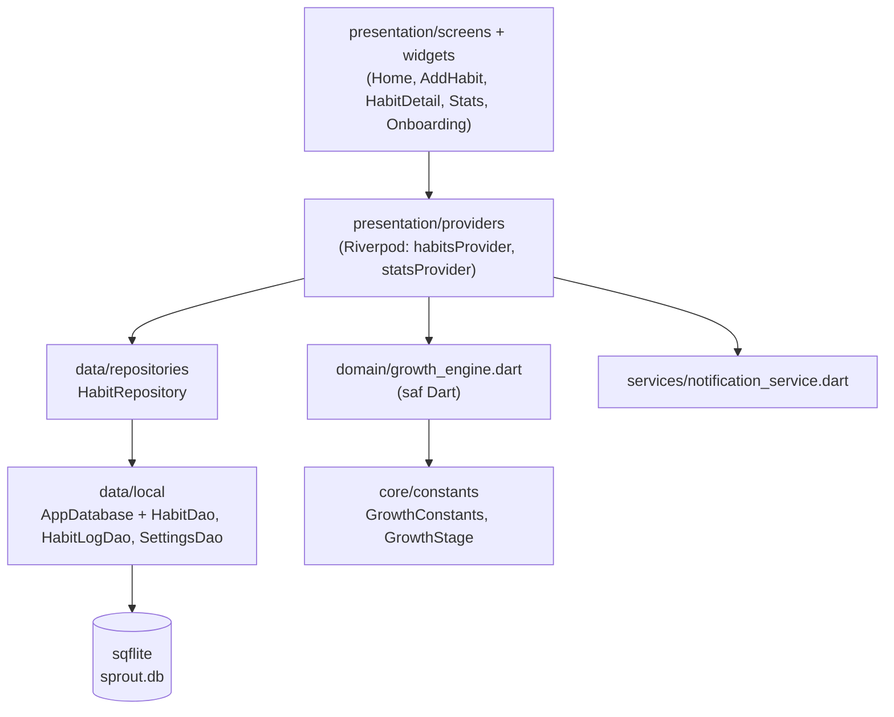

# Bitki Büyüt — Mimari

## Katmanlar

- **domain** hiçbir Flutter, sqflite veya Riverpod bağımlılığı içermez; yalnızca
  `HabitSchedule` + tamamlanan günler + bugünün tarihi alır.
- **Puan her seferinde log'lardan yeniden oynatılarak (replay) hesaplanır.**
  `habits.growth_score` yalnızca önbellektir. Böylece geçmiş bir günü düzeltmek,
  uygulamayı günlerce açmamak veya saat dilimi/yaz saati değişimi tutarsızlık
  yaratmaz.
- Uygulama ön plana döndüğünde gün değiştiyse (`AppLifecycleListener`)
  puanlar yeniden hesaplanır; solma bu sayede "arka planda" da işler.

## Büyüme algoritması

Bir **dönem** = günlük alışkanlıkta bir gün, özel günlerde seçili bir hafta günü,
haftalıkta 7 günlük blok. Her dönem sırayla işlenir:

| Durum | Etki |
|---|---|
| Tamamlandı | `taban × min(1 + (seri−1)·0.1, 2.0)` puan eklenir, seri +1 |
| Açık dönem (bugün / bu hafta), henüz yapılmadı | Etkisiz |
| Kaçırıldı | Seri sıfırlanır; ilk kaçırma tolere edilir, sonrası `5, 7, 9 … ≤15` ceza |
| Art arda 3 gün (haftalıkta 2 hafta) kaçırıldı | Bitki **solmuş** görünür |

Tüm değerler `lib/core/constants/growth_constants.dart` içindedir.

## Paketler ve gerekçeleri

| Paket | Neden |
|---|---|
| `flutter_riverpod` | Test edilebilir, `BuildContext`'ten bağımsız durum yönetimi; testlerde saat/DB/bildirim override edilebiliyor |
| `sqflite` (+ `path`) | Offline-first, ilişkisel veri (alışkanlık ↔ log, `ON DELETE CASCADE`, `UNIQUE(habit_id, date)`) |
| `intl` | Türkçe tarih/gün adları |
| `flutter_local_notifications` | Backend'siz günlük hatırlatma |
| `timezone`, `flutter_timezone` | `zonedSchedule` için zorunlu; cihazın yerel saat diliminde doğru saatte bildirim |
| `fl_chart` | Haftalık/aylık tamamlanma grafiği |
| `flutter_localizations` (SDK) | Saat seçici vb. Material bileşenlerinin Türkçe olması |
| `flutter_launcher_icons` (dev) | İkon üretimi |
| `sqflite_common_ffi` (dev) | Veri katmanı ve uçtan uca testleri masaüstünde bellek içi SQLite ile çalıştırmak |

`lottie` henüz eklenmedi: animasyon dosyaları hazır olana kadar bitkiler
`CustomPainter` ile çiziliyor (bkz. plan, Hafta 3).

## Testler

| Dosya | Kapsam |
|---|---|
| `test/domain/growth_engine_test.dart` | Evre eşikleri, streak, ihmal/ceza, solma, özel gün, haftalık, yaz saati |
| `test/data/habit_repository_test.dart` | CRUD, log upsert, cascade silme, sıfırlama |
| `test/app_flow_test.dart` | Onboarding, ekle → sula → yeniden aç (kalıcılık), evre kutlaması, solma, istatistik, silme |
