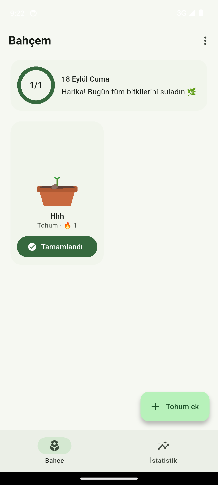
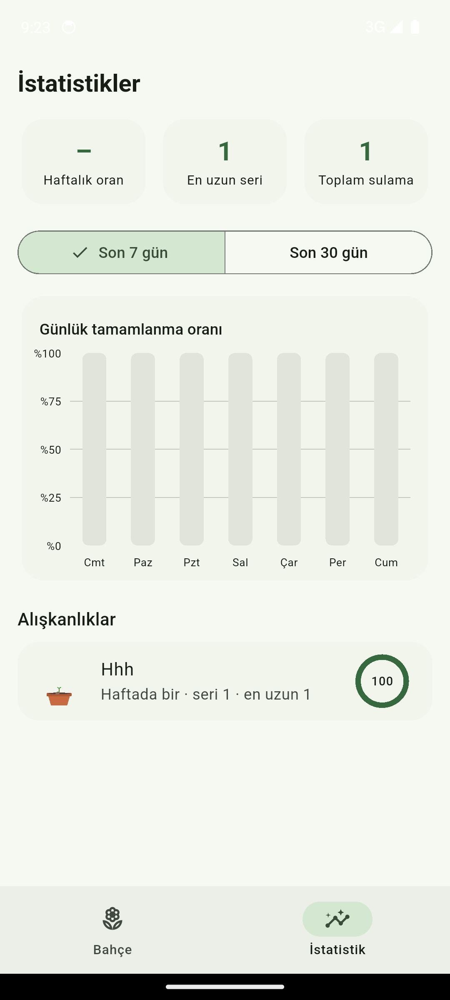

# 🌱 Bitki Büyüt

Alışkanlıklarını, her tamamladığında büyüyen bir saksı bitkisi olarak takip eden,
tamamen **offline** çalışan bir Flutter uygulaması. Sunucu yok, hesap yok —
sadece cihazda bir SQLite veritabanı.

Her alışkanlık kendi bitkisi: günlük/haftalık/özel-günlü bir hedef belirlersin,
tamamladıkça puan kazanır ve evre atlar (**Tohum → Filiz → Fidan → Çiçek → Tam
Büyümüş**); ihmal edersen bitki **solmaya** başlar, tekrar sularsan canlanır.

<p align="center">
  
  &nbsp;&nbsp;
  
</p>

## Özellikler

- **Büyüme motoru** — puan, geçmiş log'lardan her seferinde yeniden hesaplanır
  (replay); geçmiş bir günü düzeltmek veya günlerce uygulamayı açmamak asla
  tutarsızlık yaratmaz.
- **Günlük / haftalık / özel gün** hedef tipleri, seri (streak) bonusu ve
  kademeli ihmal cezası.
- **4 bitki türü** (gül, ayçiçeği, elma ağacı, kaktüs), `CustomPainter` ile
  canlı çizilir ve animasyonla büyür/solar.
- **Yerel bildirimler** — her alışkanlık kendi hatırlatma saatiyle,
  backend'siz (`flutter_local_notifications` + `timezone`).
- **İstatistikler** — son 7/30 gün tamamlanma grafiği, en uzun seri, alışkanlık
  bazlı oranlar (`fl_chart`).
- **Onboarding**, uygulama sıfırlama, ikon/splash — jüriye sunulabilir final
  ürün seviyesinde cila.

## Nasıl çalıştırılır

```bash
flutter pub get
flutter run
```

Masaüstünde veritabanı testleri için `sqflite_common_ffi` kullanılır, ek kuruluma
gerek yok.

## Mimari

```
presentation (screens + widgets)
      │  Riverpod
presentation/providers  ──────────────┐
      │                               │
data/repositories → data/local (sqflite)   domain/growth_engine.dart (saf Dart)
```

- `domain/` katmanı Flutter, sqflite veya Riverpod'dan tamamen bağımsızdır —
  yalnızca plan + tamamlanan günler + bugünün tarihini alıp saf Dart ile
  hesaplar. Testte doğrudan çağrılabilir.
- Veri katmanı: `habits` ↔ `habit_logs` (`ON DELETE CASCADE`,
  `UNIQUE(habit_id, date)`), offline-first, senkronizasyon yok.

Detaylı akış şeması, paket seçim gerekçeleri ve büyüme algoritmasının tablosu
için → [`docs/MIMARI.md`](docs/MIMARI.md). Haftalık geliştirme planı için →
[`docs/PROJE_PLANI.md`](docs/PROJE_PLANI.md).

## Test

```bash
flutter test
```

Büyüme algoritması (evre eşikleri, seri, ceza, solma, yaz saati), veri katmanı
(CRUD, cascade silme) ve uçtan uca akışlar (onboarding → ekle → sula → yeniden
aç → istatistik) dahil 30+ test.

## Haftalık gelişim kopyaları

[`Haftalar/`](Haftalar/README.md) klasörü, projenin 4 haftalık geliştirme
sürecindeki her aşamanın tam ve tek başına çalışan bir kopyasını içerir —
her biri kendi `flutter run`'ı ile açılabilir, birikimli olarak ilerler.

| Hafta | İçerik |
|---|---|
| [Hafta1](Haftalar/Hafta1/README.md) | Veri katmanı + sade liste arayüzü |
| [Hafta2](Haftalar/Hafta2/README.md) | + Growth engine, Riverpod, placeholder bitki |
| [Hafta3](Haftalar/Hafta3/README.md) | + Bahçe, çizimli/animasyonlu bitki, bildirimler |
| [Hafta4](Haftalar/Hafta4/README.md) | + İstatistik, onboarding, ikon/splash (final) |

## Kapsam dışı (bilinçli)

Firebase/bulut senkronizasyonu, kullanıcı hesabı, sosyal özellikler — proje
bilinçli olarak offline ve hafif tutuluyor. Detay için `docs/PROJE_PLANI.md`
§8.
